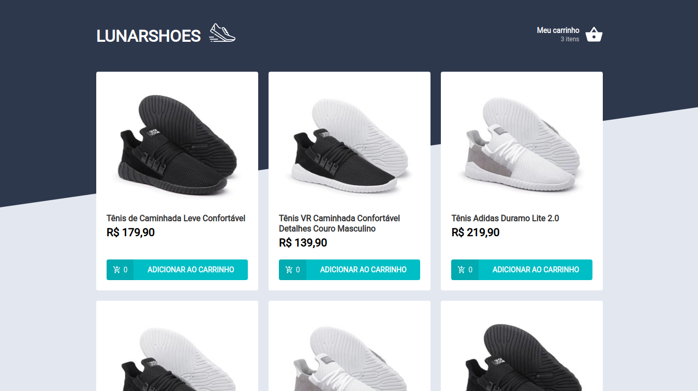

<h3 align="center">
  Desafio 03 - Criando um hook de carrinho de compras
</h3>

<p align="center">
  <a href="https://rocketseat.com.br">
    
  </a>
  
  <a href="https://www.linkedin.com/in/jefferson-bruno-venero-da-silva-b953a31bb/">
    
  </a>
</p>

<br>

## :rocket: Sobre o desafio

<p align="center">
  
</p>

Nesse desafio o principal objetivo é criar um hook de carrinho de compras. A aplicação tem duas páginas, um componente e um hook para implementar as funcionalidades pedidas nesse desafio:

- Adicionar um novo produto ao carrinho;
- Remover um produto do carrinho;
- Alterar a quantidade de um produto no carrinho;
- Cálculo dos preços sub-total e total do carrinho;
- Validação de estoque;
- Exibição de mensagens de erro;
- Entre outros.

<br>

## :wrench: Instalação e uso

```bash
# Abra um terminal e copie este repositório com o comando
git clone
# ou use a opção de download.

# Entre na pasta com
cd Novashoes

# Instale as dependências
yarn install

# Rode a aplicação
yarn start
```

<br>

## :memo: Licença

Feito com :purple_heart: by [Jefferson Bruno](https://github.com/jbrunno)

[](https://www.linkedin.com/in/jefferson-bruno-venero-da-silva-b953a31bb/)
[](mailto:j.bruno@fisica.ufmt.br)
